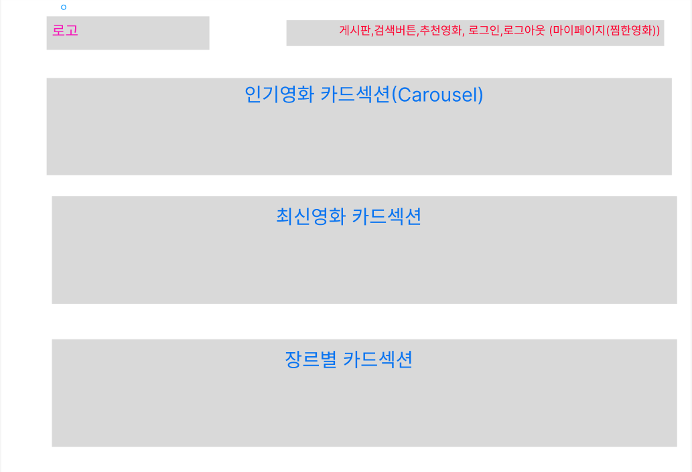
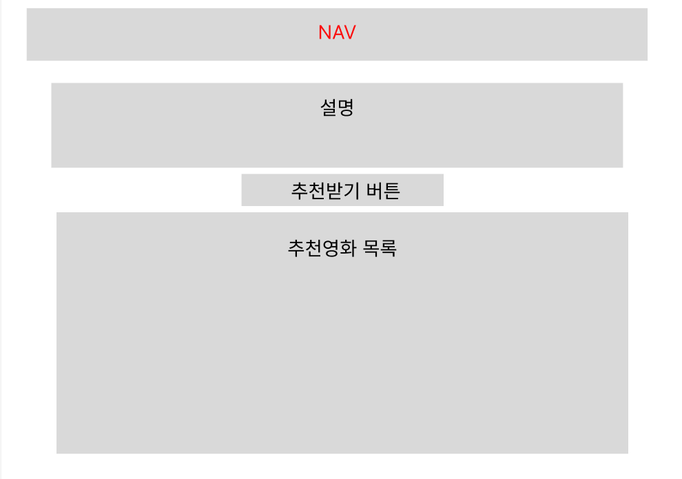
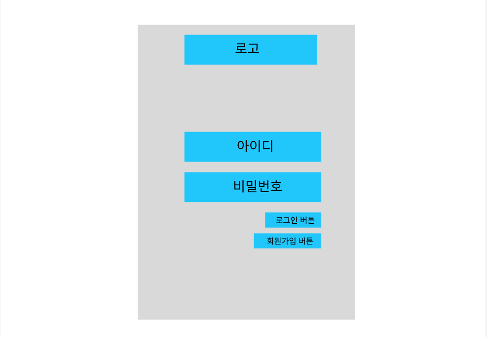
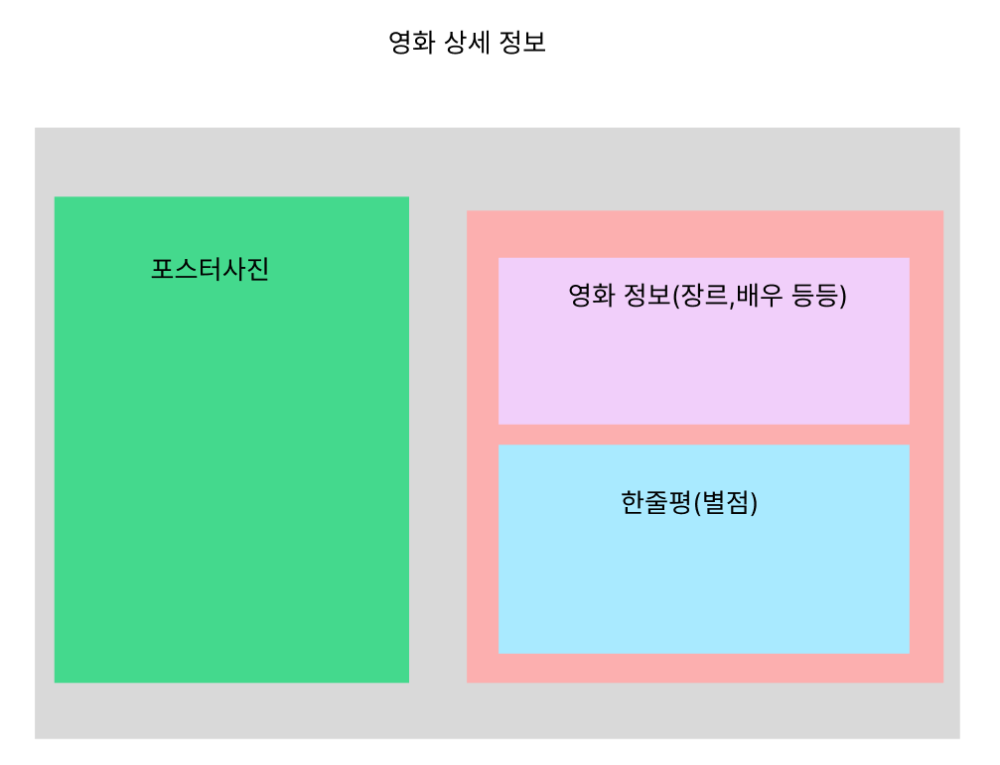
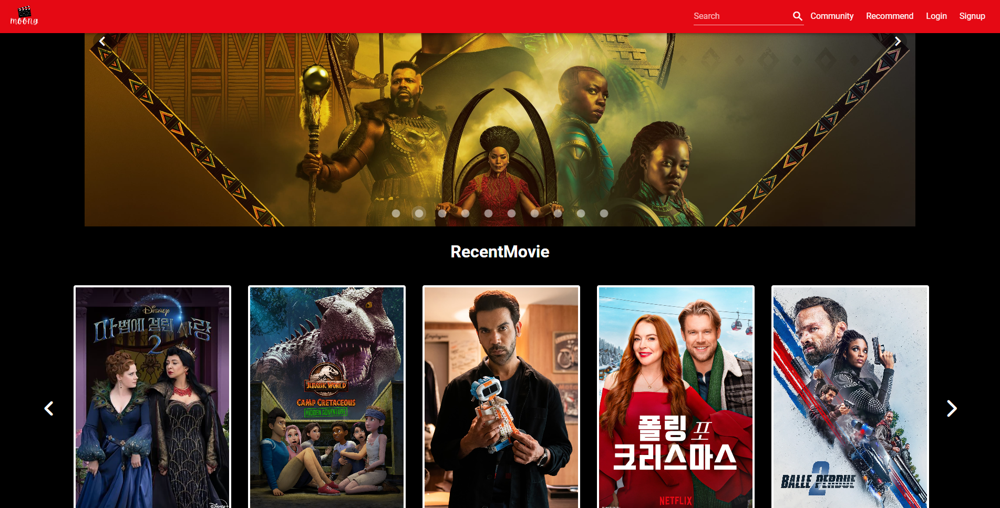
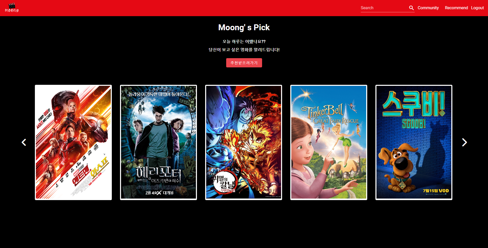
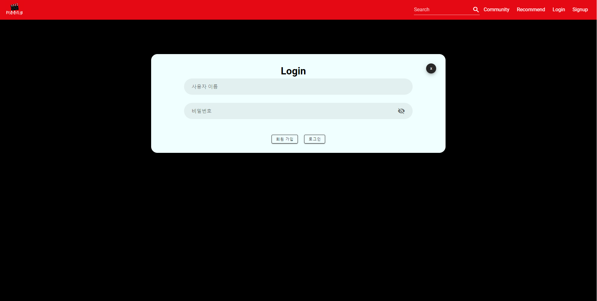
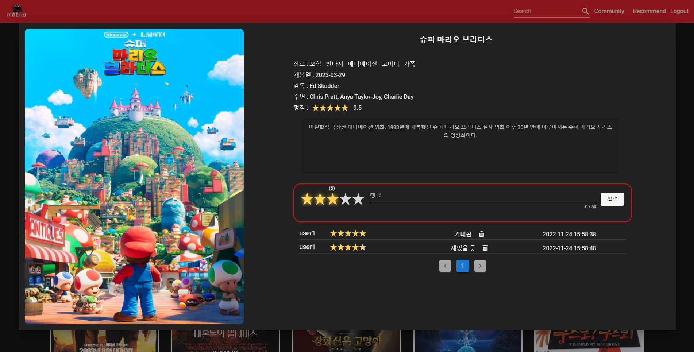
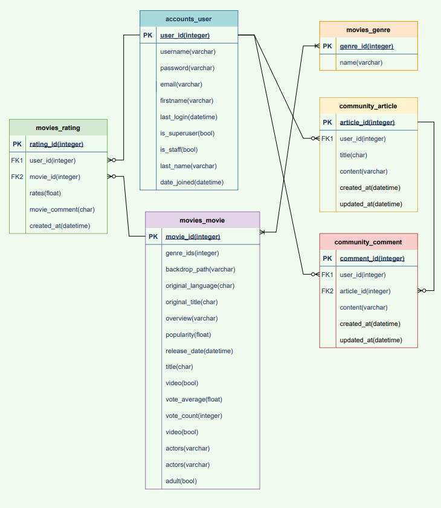
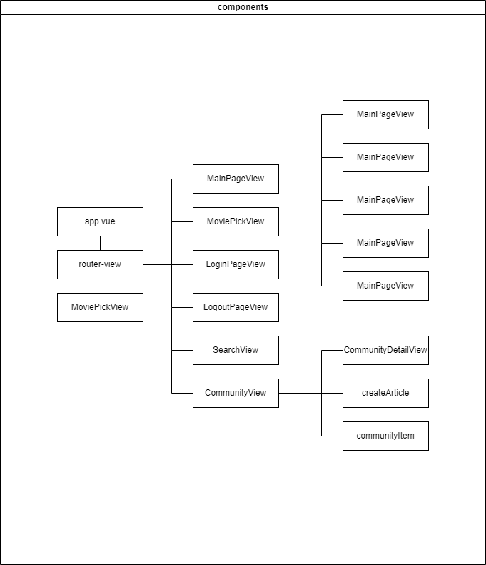

# final-pjt

## 1. 업무 분담
- 웅기, 무남 : 기획
- 웅기 : front-end => vue 컴포넌트 구성, css 디자인(vuetify 활용)
- 무남 : back-end => 데이터 가공, django 모델 설계, 알고리즘 구현

## 2. 목표 서비스 구현 및 실제 구현 정도
- 기획 사진

- 결과 사진

- 구현도는 90%정도.
앞서 계획했던 마이페이지와 영화 찜하는 작업을 수행하지 못함.
- 앞으로 추가하고 싶은 기능.  
    -웅기 : 마이 페이지 구성, 게시판, 댓글 수정 기능, 찜한 영화 기능.
    -무남 : 더 개인 맞춤형 영화 추천

## 3. 데이터베이스 모델링 (ERD)

## 4. 영화 추천 알고리즘에 대한 기술적 설명
- 기본 컨셉은 사용자가 선택한 상태(기분)에 따른 영화 추천
- 22가지 상태(기분)중 5가지를 사용자가 고르면 그에 맞는 장르의 영화를 랜덤으로 추출하여 보여줌
- 각 장르와 연결된 상태(기분)은 다음과 같음
    - "액션" : 신나는,  활기찬, 지루한
    - "모험" : 자랑스러운, 자신감넘치는, 답답한
    - "코미디" : 우울한, 웃음이필요한, 짜증나는
    - "범죄" : 통쾌한, 억울한
    - "가족" : 행복한, 편안한, 속상한
    - "판타지" : 몽환적인, 현실에서 벗어나고픈, 지긋지긋한
    - "로맨스" : 설레는, 외로운, 허전한
    - "스릴러" : 더운, 흥분되는
- 같은 장르에 연결된 기분을 여러개 선택하면 가중치를 줘야하기 때문에 고른 장르의 수에 4배를 하여 총 20가지의 영화가 추천될 수 있도록 함
    - ex) 사용자가 신나는(액션), 활기찬(액션), 지루한(액션), 더운(스릴러), 흥분되는(스릴러) 를 선택했다면 액션(3)4 =12 스릴러(2)4=8 즉 액션영화 12개, 스릴러 영화 8개를 추천하여 보여줌
## 5. 서비스 대표 기능에 대한 설명
1. 게시판 기능 
    게시판에서 본문 삭제, 댓글 추가 및 삭제 기능을 구현
2. 별점 기능
    영화 디테일 창에서 별점을 주고, 그 영화의 총 별점이 유저가 입력한 별점의 평균으로 보여줌
3. 장르별 랜덤 영화 보여주는 기능
    메인 페이지에서 영화들을 보여주는데 새로고침 때마다 장르를 랜덤으로 3개를 뽑아서 각각 20개씩의 영화를 보여줌
4. 인기, 최신 영화 추천 기능
    메인 페이지에서 캐로셀 기능으로 인기영화를 top 10개를 뽑아 보여줌
    최신 영화도 top 20개를 뽑아서 보여줌
5. 모달창으로 보여주는 영화 디테일
    영화 포스터를 클릭했을 때 페이지 이동이 아닌 모달창을 띄워줌. 모달창에서 영화의 디테일들을 보여줌.

## 6. 느낀 점.
웅기 : 처음에 프로젝트를 진행하라고 했을 땐 무엇을 어떻게 해야할지를 몰랐기에 내가 이 서비스를 구현할 수 있을까라는 두려움이 컸었다. 하지만 팀원과 함께 어떻게 프로젝트를 구현할지 고민해보고, 기획한 부분을 하나씩 만들어내서 프로젝트를 완료할 수 있었다. 완성하고 보니 아쉬운 점도 많았지만 협업의 중요성, 프로젝트의 큰 틀을 이해할 수 있었다. 서로 프론트와 백으로 파트를 나누어 진행해보니 혼자 했을 때 보다 훨씬 빠르게 업무를 수행할 수 있었고, 아이디어 회의를 통해 혼자서는 생각 못했을 아이디어를 구상할 수 있었다. 프로젝트 진행 전에는 프론트와 백의 의미를 정확하게는 이해하지 못했었고, 장고와 뷰를 부분적으로 따로따로 배웠기에 역할을 제대로 이해하지 못했었다. 프로젝트를 통해 장고와 뷰 사이의 관계를 알게 되었다. 
아쉬운 점은 너무 뷰에서 모든 알고리즘을 처리하려한 부분이였다. 장고에서는 단순히 큰 데이터를 보내는 역할만 수행하게하고, 나머지 디테일한 데이터 처리는 대부분 뷰에서 하려고 했는데, 이렇게 하다보니 페이지가 무거워질 것 같다는 느낌이 들었다. 지금은 겨우 1,500개 정도의 데이터만을 처리하면 됐지만 , 앞으로는 훨씬 많은 데이터를 처리해야 하므로, 백엔드 쪽에서의 데이터 처리를 생각해보아야겠다.  기획에서도 아쉬움이 많았다. 처음 하는 프로젝트이다 보니 기획부분의 중요성을 제대로 알지 못했었다. 기획은 적당히 하고 하면서 더 추가하자는 마음으로 진행하다 보니, 시간 분배를 제대로 하지는 못한 것 같다.
 앞으로의 프로젝트에서 이번 프로젝트로 배운 부분을 잘 적용할 수 있도록 하겠다.

무남 : 처음 이 프로젝트를 시작하기 전에 다른 기수가 만든 프로젝트를 봤을 때 진짜 존재하는 사이트처럼 보여서 우리가 저 정도의 사이트를 만들 수 있을지 걱정이 매우 많았다. 또한 백엔드와 프론트엔드를 연결하여 사용하는 것이 거의 처음이였기 때문에 자신감이 많이 떨어진 채로 프로젝트를 시작하였다. 프로젝트 시작 전에 교수님들께서 기획의 중요성을 많이 강조하셨기 때문에 기획을 잘 하려고 노력했고 기능을 하나하나 만들어 가면서도 기획의 중요성을 더 깨닫게 되었다. 기능을 하나하나 만들어 가며 매우 작은 기능 하나에도 많은 노력이 들어간다는 것을 알게 되었고 여러가지 고려해야 할 사항이 많다는 것을 알게 되었다. 여러 어려움이 많았지만 혼자가 아니라 같은 팀원이 있었기 때문에 같이 잘 해결해 나갈 수 있었고, 협업의 중요성을 다시 한번 느끼게 되었다. 비록 처음에 기획한 기능을 모두는 구현하지 못했지만 1학기 전반적으로 배운 내용들을 직접 내 손으로 활용할 수 있어서 좋은 경험이였다. 비록 처음에는 걱정이 많았지만 프로젝트를 완성하고 결과물을 보면서 나도 잘 할 수 있다는 자신감이 생겼고 앞으로도 이 자신감을 가지고 열심히 배우고 성장해야겠다.

